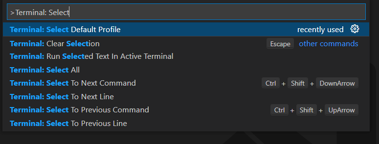
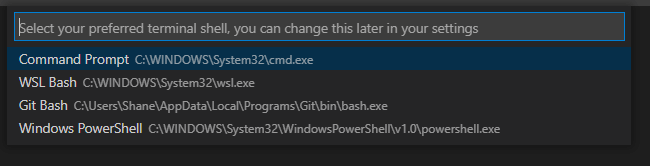

# Window Setup

Chances are you may have a Windows-based computer. However, you may want to contribute to this project and open source.

In this guide, we will go over how to set up your environment smoothly.

We will setup:

1. Visual Studio Code
2. BASH
3. Go over command line commands
4. Set up Git and Github
5. Fork this repo

## Why is a setup required

Most programming tutorials use `bash`, a command-line language and shell for UNIX-based systems. However, windows-based computers are not based on UNIX but have their proprietary systems.

Since Apple's OSX systems are based on UNIX, the initial bash setup will not apply. However, discussions on common command line commands may be of use.

## Tool setup

### Visual Studio Code

First, you will need a code editor. Code editors allow you to write and edit code and content. They are a key tool for open source collaboration—the most popular and versatile code editor circa 2022 in Visual Studio Code. Click on the [Visual Studio Code link](https://code.visualstudio.com/) and follow the installation instructions.

### Git - Version Control Software

Great! We are on our way! Next, we will set up Git on our machines. Git is version control software to help people collaborate over files, especially in large teams.

Have you ever had to work on the same file as someone in a network? How about working at the same time? Chances are you probably had to copy the file, then figure out where to paste your portion to the original file. What if your edits occurred to the same place another person edited? Or worse, what if you worked on a document and want to get an old version? Will you have 50 different copies? How do you track all that?

With Git, anyone can create "save points" they can revisit. Git allows you to create different versions to test ideas called branches and easily add them to the original. They even allow thousands (even millions) of people to collaborate on the same files seamlessly and more easily. Git was born out of necessity as the founder of Linux, Linus Torvalds, bumped into headaches from working on code with many contributors and no way to organize or track versions.

Let's get the power now! To [install git](https://git-scm.com/downloads), go to the link and follow the instructions. To check which type of machine you have (32-bit vs. 64-bit), [follow these instructions](https://support.microsoft.com/en-us/windows/32-bit-and-64-bit-windows-frequently-asked-questions-c6ca9541-8dce-4d48-0415-94a3faa2e13d). Chance are if you have a recent machine, it will be 64 bit. It's worth double-checking.

Like the command line, 95% of the time, you will only use a handful of Git commands. The rest will be corner-case which you can figure out as needed via asking friends, the internet, or Google. Both can be learned over a weekend. The Coding Train has a great ["Git and Github For Poets"](https://www.youtube.com/playlist?list=PLRqwX-V7Uu6ZF9C0YMKuns9sLDzK6zoiV) Youtube Tutorial series. Codecademy also has a [great Git course](https://www.codecademy.com/learn/learn-git). Additionally, here is a [visual git explainer cheat sheet](https://marklodato.github.io/visual-git-guide/index-en.html).

### Set up Bash in VS Code

Now let's combine the power of VS Code and Bash. As mentioned before, Windows uses its proprietary system. That includes its command-line language and shell called PowerShell. However, most tutorials use Bash-based commands, so to avoid headaches, let's [setup bash in your machine](https://www.shanebart.com/set-default-vscode-terminal/) by following the instructions in this article.

1. Open Visual Studio Code
2. Press `CTRL + SHIFT + P` to open the Command Palette
3. Search for "**Terminal: Select Default Profile"** (previously **"Terminal: Select Default Shell"**).
   

4. Select your preferred shell. In my case, I selected "Git Bash."
   
5. Check if it works.
   First, check if the terminal starts with `$`
   Then run the following:
   `pwd`

If there is no error, it works!

## Understanding the command line

You will quickly grow accustomed to the command line the more you use it. Anecdotally, 95% of the time, you will only use anywhere from 5-to 10 commands. Refer to this [command line cheat sheet](https://www.git-tower.com/blog/command-line-cheat-sheet/). The most frequent commands will be around navigation and file manipulation. That's mostly it! If you want additional practice with the command line, you can check out this free [command line course by Codecademy](https://www.codecademy.com/learn/learn-the-command-line).

[start .](https://stackoverflow.com/questions/40879648/how-to-open-the-current-directory-on-bash-on-windows)

[Overview: Setup your github](https://docs.github.com/en/get-started/quickstart/set-up-git)

[set up your username in git](https://docs.github.com/en/get-started/getting-started-with-git/setting-your-username-in-git)

[set up your email in git](https://docs.github.com/en/account-and-profile/setting-up-and-managing-your-personal-account-on-github/managing-email-preferences/setting-your-commit-email-address)
